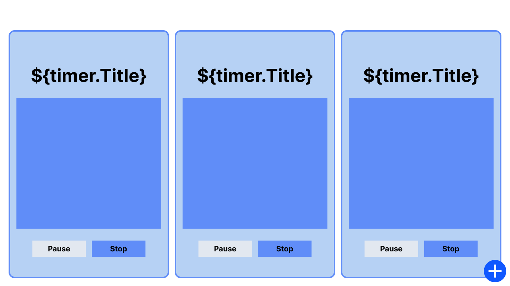

# Play Timer - the timer for Games & Tournaments

## Table of contents

- [Overview](#overview)
  - [Challenge](#challenge)
  - [Concept](#concept)
  - [How It Would Work](#mechanics)
  - [Component Hierarchy](#hierarchy)
- [My process](#my-process)
  - [Built with](#built-with)
- [Author](#author)

## Overview

### Challenge

This idea originated from a recent issue encountered during a visit to a local tournament center this week. The center has monitors positioned at a high angles on the walls, with the intention of displaying tournament information, in this case, a timer(s). However, they face a challenge as they host multiple tournaments simultaneously. Consequently, they require a user-friendly website or app capable of streaming multiple timers, each with its own unqiue identifier. The priority is for this application to be lightweight and easy to use.

### Concept

I started sketching up a solution that accounted for mobile first (I imagined that judges or tournament holders would walk around with phones with the timers on them to give that information to players as needed), but speaking with the stakeholder, for this particular stakeholder, a layout that accounts for 3 tournaments and uses the space of the monitor more efficiently is what will make it to production. But the concept helped me think through how to execute in code, and whether a maximum of three tournament timers or ten, the conecpt remains the same.

#### Mechanics

How the app works:

1. When the user goes to the website, they are prompted to create a new timer.
2. The user goes through a series of modal windows inputting information about the event that the timer is for. Things like the "Name of the Event", "What Game is being played at the event", and "How long their timer might be". All the while, everytime they step forward in the modal, the app is setting to state the new piece of information that the user gives.
3. When the user gets to the end of the modal interaction, the unique timer object is built out, and set to state. There the app renders any timer object with the use of the Timer Component.
4. The timer component works in 3 parts:
   - First, within the timer component, the timer object is deconstructed, and the parts of the object are set to state to display the initial values on the timer, the name of the event, the initial time, etc.
   - Then a series of call back functions are put together to create a reference date object, and a countdown of miliseconds from that date object + the time that the user entered for how long the timer should be. Every second the the interval is triggered, rendering the state at the time of the interval, because the interval is once every second, when it renders to us the timer has counted down.
   - Finally, the return statement returns a timer that uses an object lookup to decide what styling it should have based on the game that the user is the timer for. JSX and conditionals are used to toggle the look of the timer depending on whether or not the timer is expired or not.
5. The user decided whether or not they want to recycle the timer for the round or not. If they want to initiate it for another round, they click reset, and a function in the timer component reruns the code using the initial time passed to the object. If they want to delete it and start again, a "X" icon triggers a function to create an array using the filter method that doesn't include the id of the rendered timer component that triggered the onClick.

### Hierarchy

The Hierarchy has changed a little bit from the original diagram that I created (see below). I was more focused on the Chackra UI components, but I realized later in development that there's a lot of documentation online about how these components work, and I should have just focused on the big components like the ones I talk about below:

- There is the main app, that holds the Timer Objects.
  - There is a modal that is a child of this component that the user uses to create the Timer Object.
    - There are further child components to this modal that dictate the stage that the user is in in Timer Creation, these stages have functions and ChakraUI elements that help dictate and format what and how the information should be passed to the Timer Object.
  - Then there is the actual Timer Component that contains the countdown logic, and the actual return of the timer.

### Links

- [Live Site](https://playtimer.anthonyjmedina.com/)
- [GitHub](https://github.com/ajm24027/playtimer)

## My process

I actually ended up recording my process in the form of blog posts while in the middle of making this app on my freetime. I'll leave the links below.

[Part 1](https://anthonyjmedina.com/posts/the-making-of-playtimer-1.md/) - I set up the initial timer logic and attempt to figure out why the way that my iniitial conditionals didn't work in React. Additionally I learn a lesson in Intervals and Interval IDs

[Part 2](https://anthonyjmedina.com/posts/the-making-of-playtimer-2.md/) - I figure out how to pass up props and information from child components up to the parents, this is how I use the Modal Children to create the Timer Object step by step.

[Part 3](https://anthonyjmedina.com/posts/the-making-of-playtimer-3.md/) - I pivot the project to move past some obstacles that I was facing with ChakraUI Progress Bar. This is where the idea of making Timer Variants, and prototyping for the context of the Apps setting came into play.

[Part 4](https://anthonyjmedina.com/posts/the-making-of-playtimer-4.md/) - I realize the fulll power of JSX and being able to create incredibly concise code that works just the same using conditionals inside of return statements.

### Built with

- ReactJS
- Typescript
- Chakra UI
- Bun

## Check Me Out

- Website - [anthonyjmedina.com](https://anthonyjmedina.com)
- Frontend Mentor - [@ajm24027](https://www.frontendmentor.io/profile/ajm24027)
- GitHub - [@ajm24027](https://github.com/ajm24027)
